## Part 1. Установка ОС

- Был установлен Ubuntu 20.04 Server LTS без графического интерфейса. Для виртуализации использовалась программа VirtualBox.
- Выведем версию Ubuntu с помощью команды *cat /etc/passwd*.

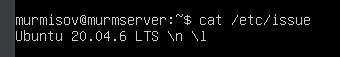

## Part 2. Создание пользователя

- С помощью команды *sudo useradd -G adm admin* создаем пользователя, отличного от созданного при установке, где *-G adm* - добавление в группу *adm*.

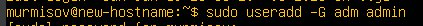

- Убедимся, что новый пользователь есть в выводе команды *cat /etc/passwd*.

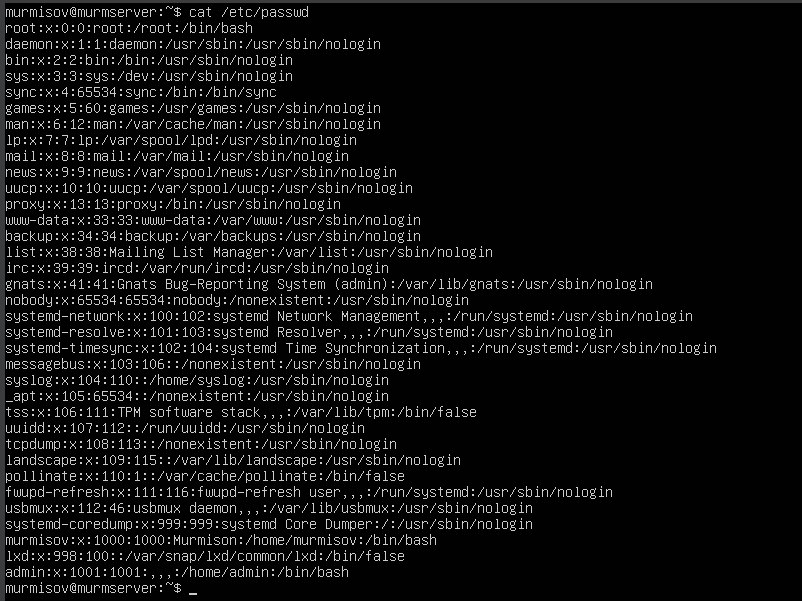

## Part 3. Настройка сети ОС

- Задаем название машины user-1.

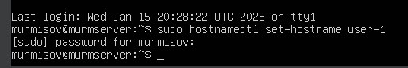

- Установим временную зону, соответствующую моему местоположению (*Asia/Yekaterinburg*).

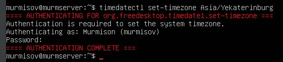

- Выведем названия сетевых интерфейсов с помощью команды *ip link show*. 

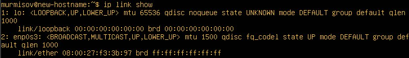

> **Интерфейс lo** - виртуальный интерфейс обратной петли, который позволяет компьютеру обращаться к самому себе.

- Получим ip-адрес устройства от DHCP-сервера с помощью команды *ip addr show enp0s3*.

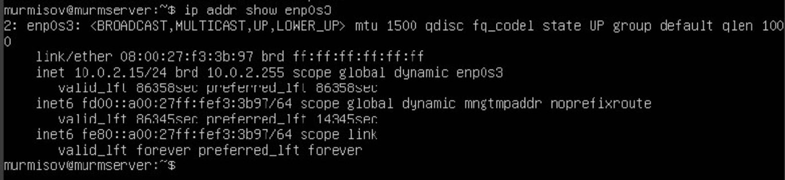

> **DHCP** - Dynamic Host Configuration Protocol. Это протокол, позволяющий автоматически присваивать ip-адреса устройствам в сети.

- Определим и выведем на экран внешний ip-адрес шлюза (ip) и внутренний IP-адрес шлюза, он же ip-адрес по умолчанию (gw).
    1. Внутренний адрес определяем с помощью команды *ip r* (*ip route show*) 

    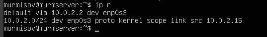

    2. Внешний адрес определяем с помощью команды *curl ifconfig.me*

    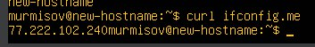

- Зададим статичные настройки *ip*, *gw*, *dns*. 
    1. Поменяем соответствующие поля в *10-static.yaml*.

    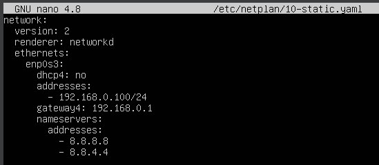

    2. Применим настройки командой *sudo netplan apply*.

- Перезагрузимся и убедимся, что статичные сетевые настройки соответствуют заданным в предыдущем пункте.
    1. Перезагружаемся с помощью команды *sudo reboot*.
    2. Смотрим сетевые настройки с помощью команды *ip addr show enp0s3* и видим, что они соответствуют ожидаемым.

    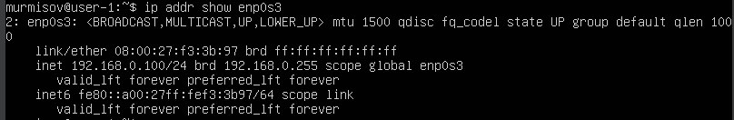

- Пропингуем удаленные хосты 1.1.1.1 и ya.ru.
    1. Пингуем 1.1.1.1 с помощью команды *ping 1.1.1.1*.

    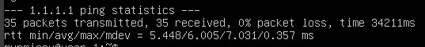
    
    2. Пингуем ya.ru с помощью команды *ping ya.ru*.

    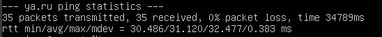

## Part 4. Обновление ОС

- Обновим системные пакеты до последней версии.
    1. Обновим список доступных пакетов командой *sudo apt update*.
    2. Установим обновления командой *sudo apt upgrade*.
    3. Убедимся, что получены последние списки пакетов.

    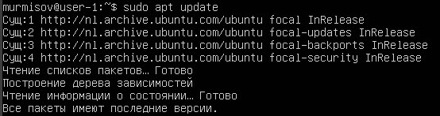

    4. Убедимся, что все доступные пакеты установлены.

    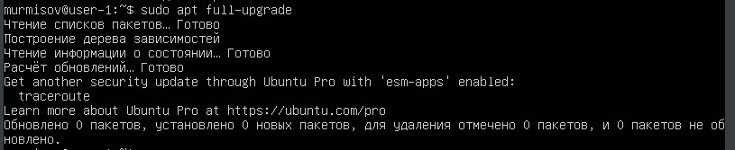

## Part 5. Использование команды sudo

> **sudo** - утилита, позволяющая пользователю запускать программы с привилегиями другой учетной записи

- Используя sudo, изменим hostname ОС от имени admin. Для этого применим команду *sudo -u admin hostnamectl set-hostname new-hostname*.

- Проверим, что *hostname* изменился.

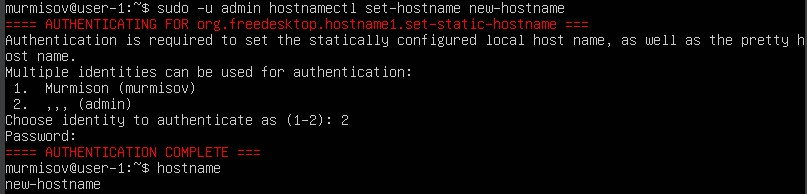

## Part 6. Установка и настройка службы времени

- Выведем время моего часового пояса(*Asia/Yekaterinburg*) с помощью команды *timedatectl show*.

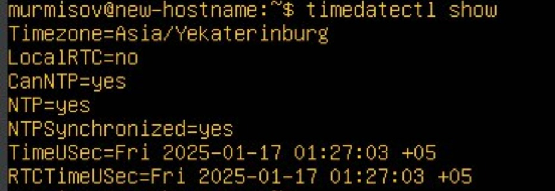

## Part 7. Установка и использование текстовых редакторов

> Для выполнения задания будем использовать следующие текстовые редакторы: *Vim*, *Nano*, *Joe*.

- Используя каждый из редакторов напишем свой никнейм и закроем файлы с сохранением.

    1. Создадим файл test_vim.txt. Напишем никнейм и закроем файл с сохранением изменений c помощью *:wq*.

    

    2. Создадим файл test_nano.txt. Напишем никнейм и закроем файл с сохранением изменений с помощью *Ctrl+X Y*.

    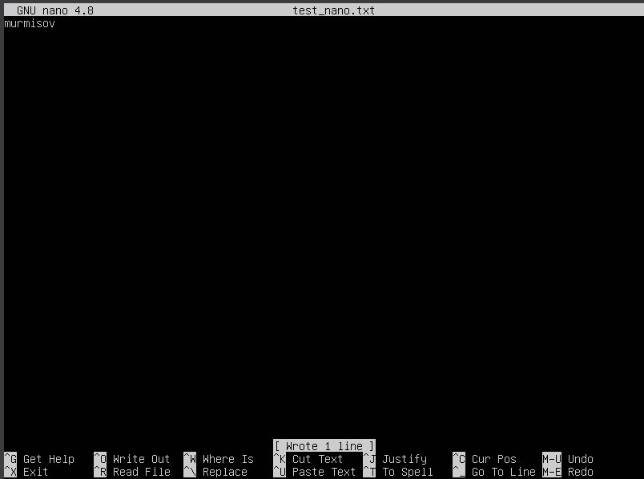

    3. Создадим файл test_joe.txt. Напишем никнейм и закроем файл с сохранением изменений с помощью *Ctrl+K Ctrl+X*.

    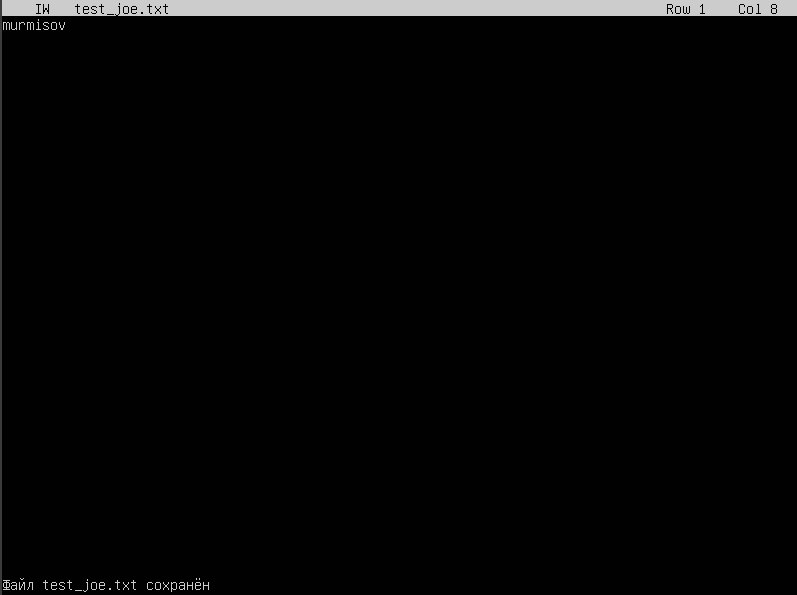

- Используя каждый из редакторов отредактируем файлы и закроем их без изменений.

    1. Отредактируем файл test_vim.txt, заменив никнейм на *21 School 21*. Выйдем без сохранения с помощью *:q!*.

    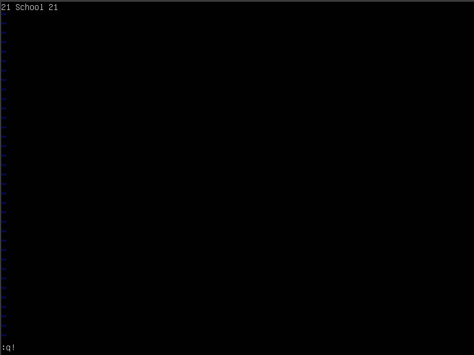

    2. Отредактируем файл test_nano.txt, заменив никнейм на *21 School 21*. Выйдем без сохранения с помощью *Ctrl+X N*.

    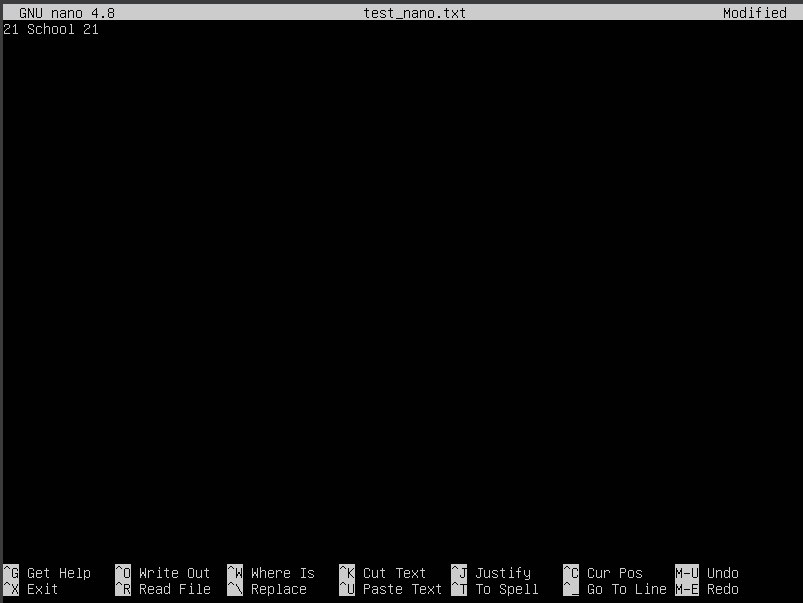

    3. Отредактируем файл test_joe.txt, заменив никнейм на *21 School 21*. Выйдем без сохранения с помощью *Ctrl+KQ n*.

    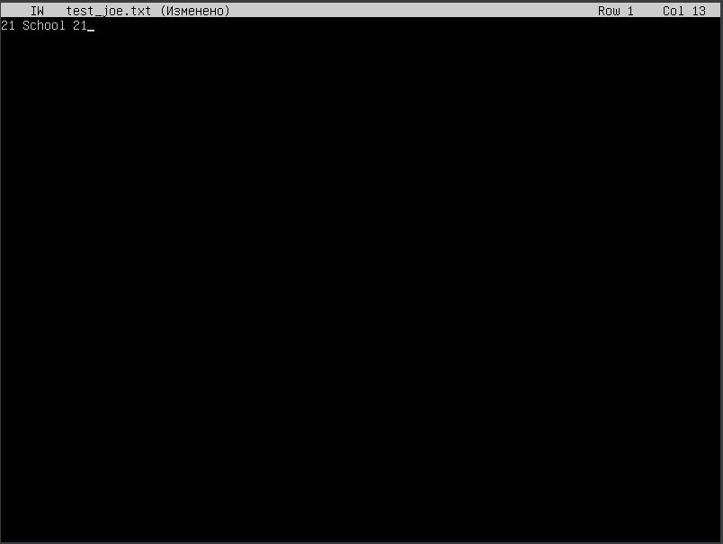

- Используя каждый из редакторов освоим функции поиска.

    1. Отредактируем файл test_vim.txt. Для поиска слова используем *?*.

    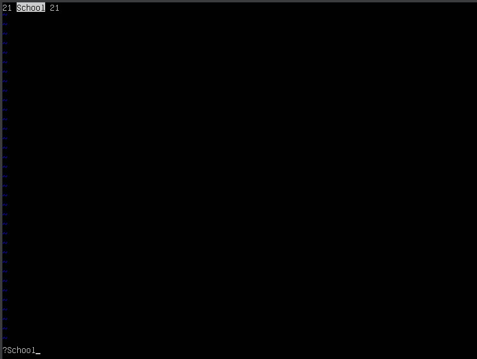

    2. Отредактируем файл test_nano.txt. Для поиска слова используем *Ctrl+W*.

    

    3. Отредактируем файл test_joe.txt. Для поиска слова используем *Ctrl+W*.

    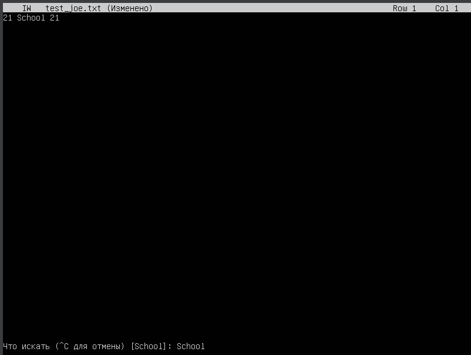

- Используя каждый из редакторов освоим функции замены.

    1. Для замены в Vim используем *:s*.

    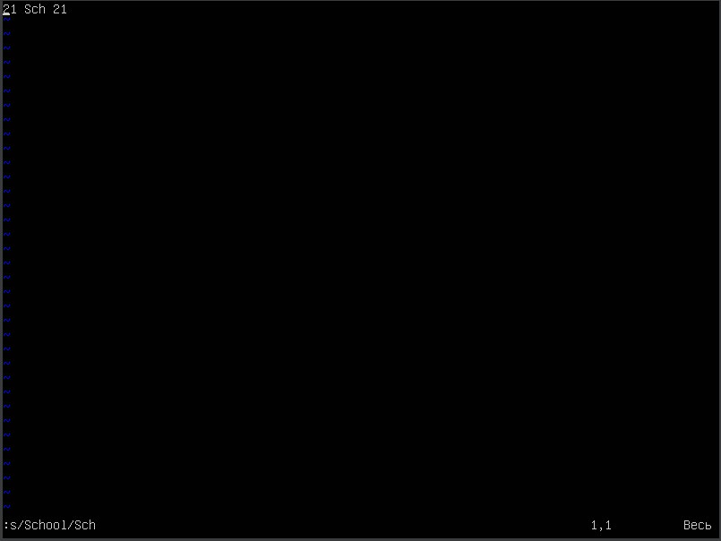

    2. Для замены в Nano используем *Ctrl+/*.

    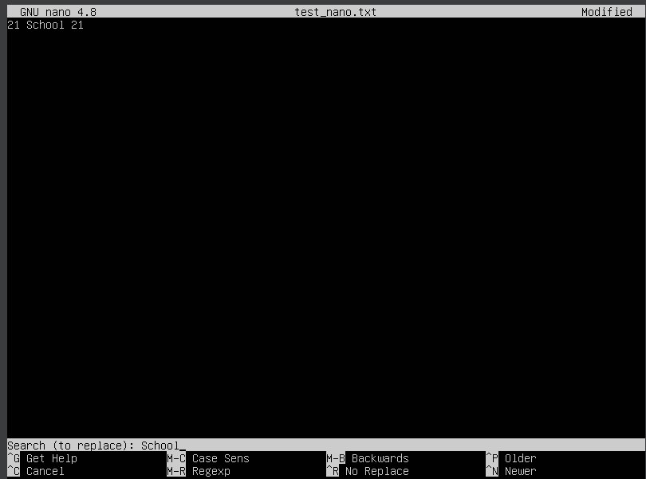

    3. Для замены в Joe используем *Ctrl+KF R*.

    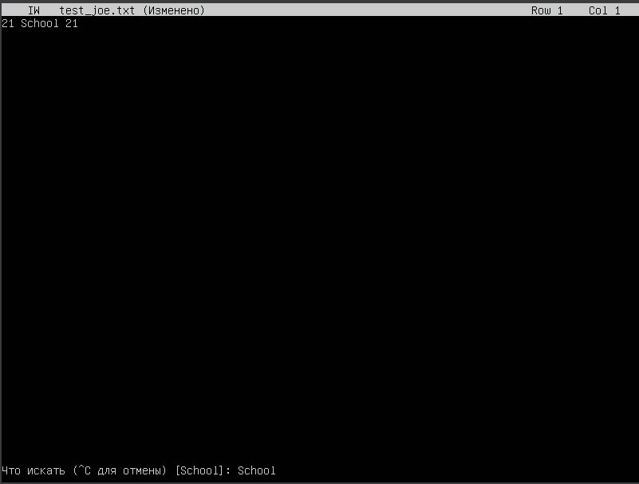

    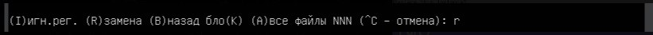

## Part 8. Установка и базовая настройка сервиса SSHD

- Установим службу SSHd с помощью команды *sudo apt install openssh-server*.

- Добавим автостарт службы при запуске системы с помощью команды *sudo systemctl enable ssh.service*.

- Перенастроим службу SSHD на порт 2022. Для этого изменим конфигурацию файла *etc/ssh/sshd_config* и перезагрузим службу.

- Используя команду *ps aux | grep sshd* (*aux* - все процессы, *grep sshd* - вывод процессов, в которых упоминается sshd) покажем наличие процесса sshd. 

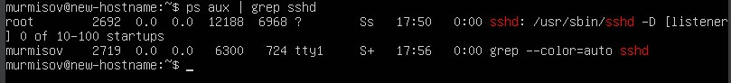

- Перезагрузим систему с помощью команды *sudo reboot*.

- Посмотрим вывод команды *netstat -tan* и объясним его.

    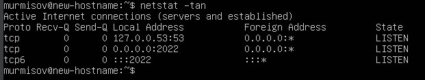

    1. **Proto** - используемый сетевой протокол.

    2. **Recv-Q** - количество байтов в очереди на прием данных.

    3. **Send-Q** - количество байтов вочереди на отправку данных.

    4. **Local Address** - локальный IP-адрес и порт, на котором прослушиваются соединения.

    5. **Foreign Address** - IP-адрес и порт хоста, от которого принимается соединение.

    6. **State** - состояние TCP-соединения.

    7. **0.0.0.0** означает любой IP-адрес, * означает любой порт.

    8. **-t** - флаг для вывода только TCP-соединений

    9. **-a** - флаг для вывода всех соединений (не только прослушиваемых).

    10. **-n** - IP-адреса не преобразуются в имена хостов.

## Part 9. Установка и использование утилит top, htop

- Запустим утилиту top.

    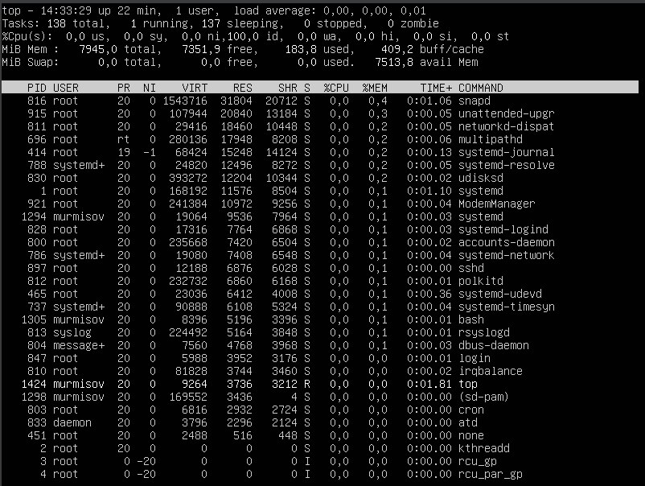

    1. **uptime**: 22min.

    2. **Количество пользователей**: 1.

    3. **Средняя загрузка**: за 5 минут 0.00, за 15 минут 0.01.

    4. **Общее количество процессов**: 138.

    5. **Загрузка CPU**: 0.0.

    6. **Загрузка памяти**: с помощью M отсортировали процессы по убыванию памяти, посчитали сумму и получили 3%.

    7. **PID процесса, который занимает больше всего памяти**: 816.

    8. **PID процесса, который занимает больше всего процессорного времени**: 1.

    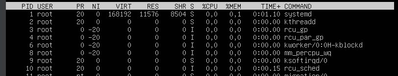

- Запустим утилиту htop.

    1. Отсортируем по *PID* с помощью *F6 -> PID*.

    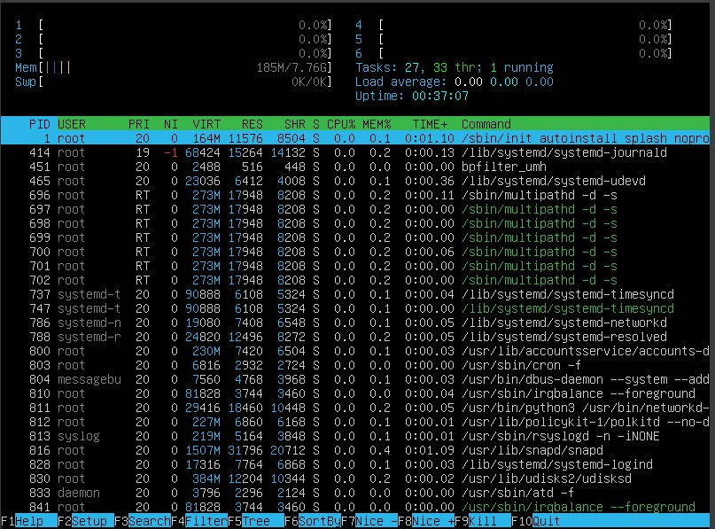

    2. Отсортируем по *PERCENT_CPU* с помощью *F6 -> PERCENT_CPU*.

    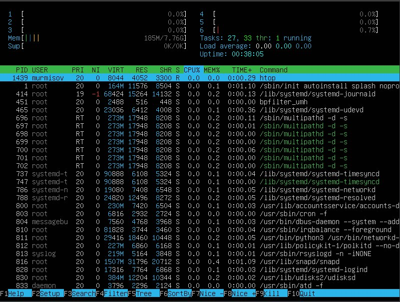

    3. Отсортируем по *PERCENT_MEM* с помощью *F6 -> PERCENT_MEM*.

    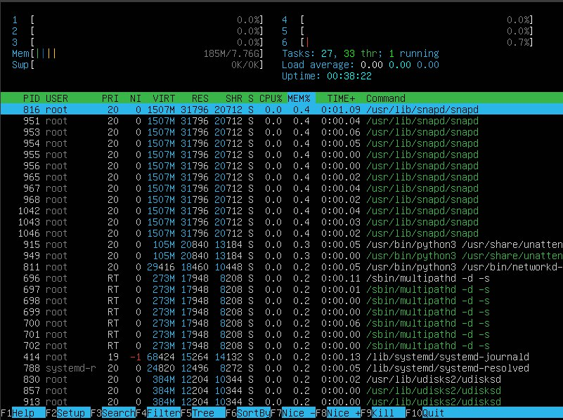

    4. Отсортируем по *TIME* с помощью *F6 -> TIME*.

    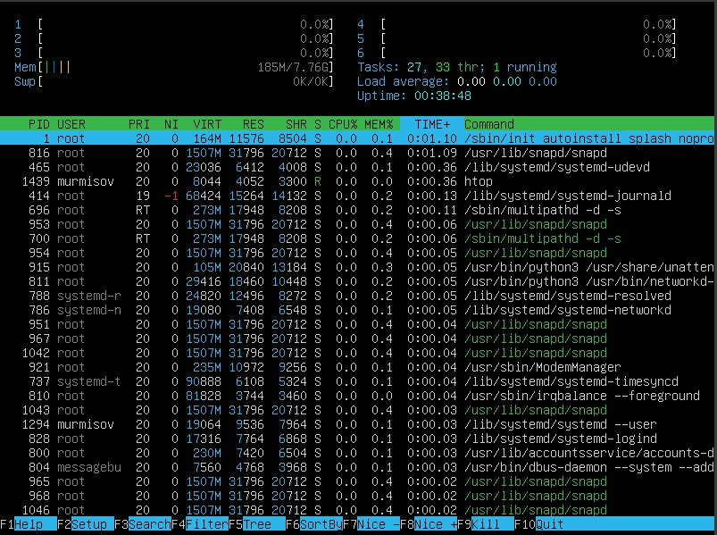

    5. Отфильтруем для процесса sshd с помощью *F4 -> sshd*.

    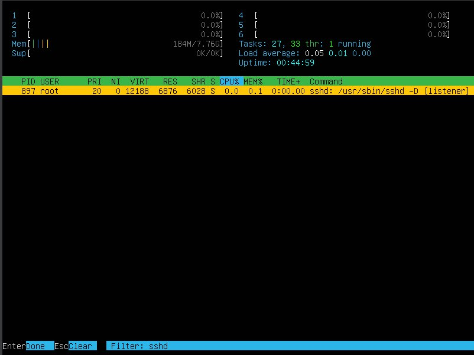

    6. Найдем процесс syslog с помощью *F3 -> syslog*.

    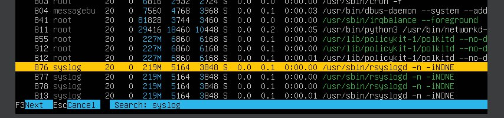

    7. Добавим *hostname*, *clock* и *uptime* с помощью *F2 -> Meters*.

    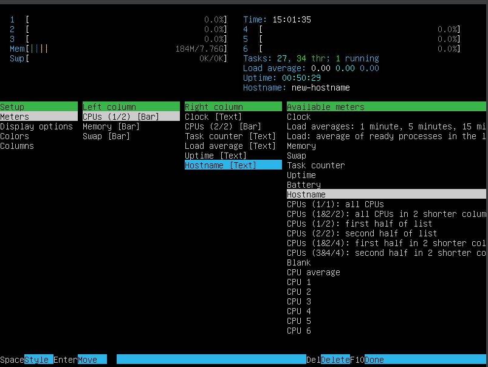

## Part 10. Использование утилиты fdisk

- Запустим команду *fdisk -l*.

    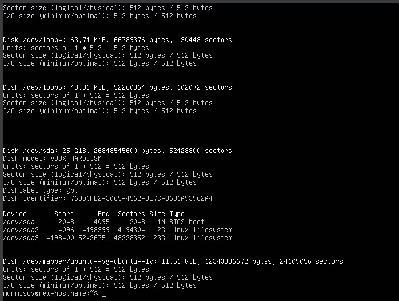

    1. **Название жесткого диска**: /dev/sda.

    2. **Размер жесткого диска**: 25gb.

    3. **Количество секторов**: 52428800.

- Размер swap узнаем с помощью команды *free*. Видим значение 0.

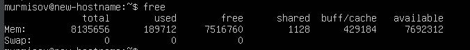

## Part 11. Использование утилиты df

- Запустим команду df.

    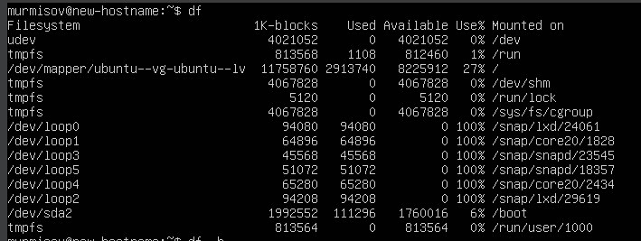

    1. **Размер корневого раздела**: 11758760kb.

    2. **Размер занятого пространства корневого раздела**: 2913740kb.

    3. **Размер свободного пространства корневого раздела**: 8225912kb.

    4. **Процент использования корневого раздела**: 27.

- Запустим команду *df -Th*(-T - отображение типа файловой системы, -h - отображение данных в человекочитаемом формате).

    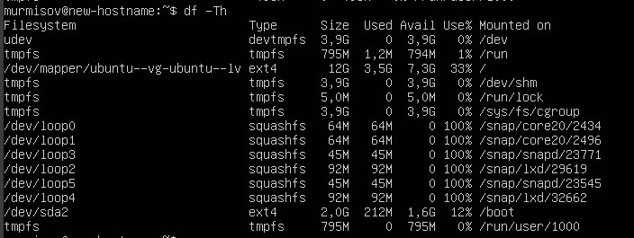

    1. **Размер корневого раздела**: 12gb.

    2. **Размер занятого пространства корневого раздела**: 2.8gb.

    3. **Размер свободного пространства корневого раздела**: 7.9gb.

    4. **Процент использования корневого раздела**: 27.

    5. **Тип файловой системы**: ext4.

# Part 12. Использование утилиты du

- Запустим команду *du*.

    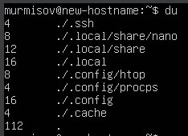

    1. Выведем размер папки /home в байтах, в человекочитаемом виде.

    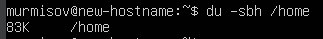

    2. Выведем размер папки /var в байтах, в человекочитаемом виде.

    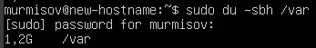

    3. Выведем размер папки /var/log в байтах, в человекочитаемом виде.

    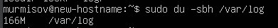

    4. Выведем размер всего содержимого в var/log.

    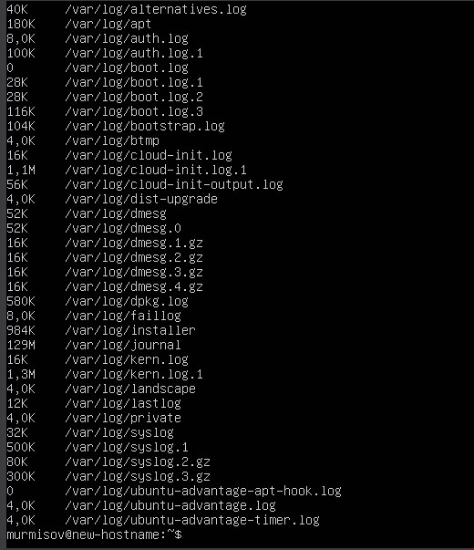

## Part 13. Установка и использование утилиты ncdu

- Установим утилиту ncdu с помощью команды *sudo apt install ncdu*.

- Выведем размер папки */home*.

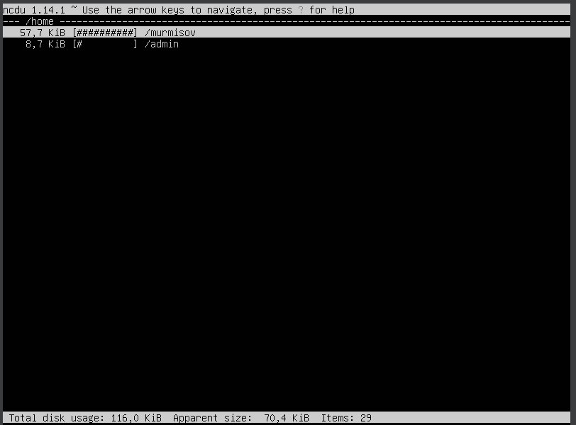

- Выведем размер папки */var*.

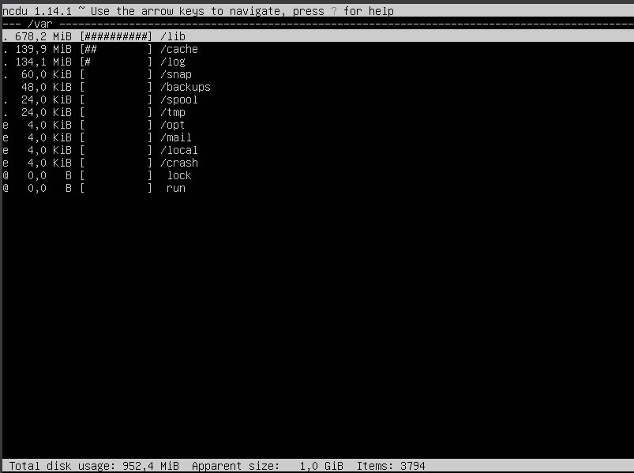

- Выведем размер папки */var/log*.

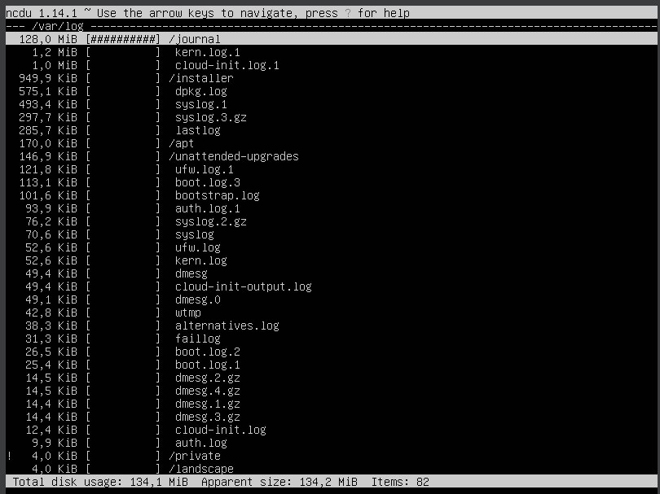

## Part 14. Работа с системными журналами

- Откроем файлы */var/log/auth.log*, */var/log/dmesg*, */var/log/syslog* с помощью текстового редактора *Nano*.

- В файле */var/log/auth.log* найдем время последней успешной авторизации, имя пользователя и метод входа в систему.

    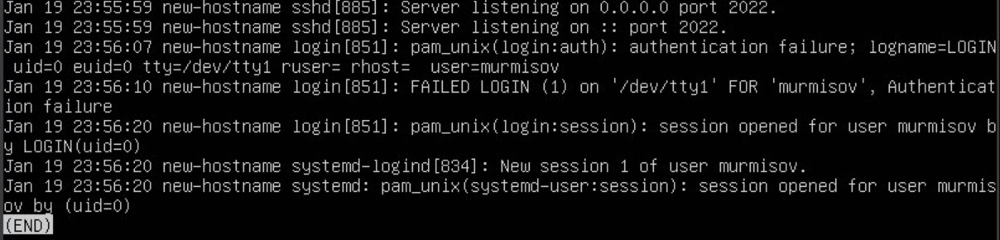

    1. **Время последней успешной авторизации**: 23:56:20.

    2. **Имя пользователя**: murmisov.

    3. **Метод входа в систему**: tty1.

- Перезапустим службу SSHd и найдем в *auth.log* сообщение о рестарте службы.

    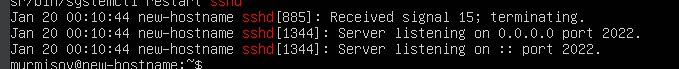

## Part 15. Использование планировщика заданий CRON

- Запустим команду *uptime* через каждые 2 минуты. Для этого откроем планировщик для редактирования с помощью *crontab -e* и добавим задачу */2 * * * * uptime.

- Найдем в системных журналах строчки о выполнении задачи.

- Выведем на экран список текущих заданий для CRON.

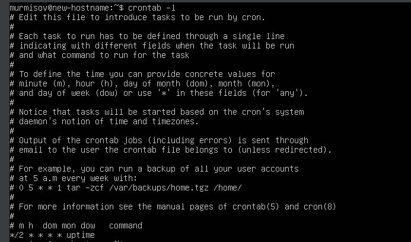

- Удалим все задания из планировщика с помощью команды *crontab -r*.

- Выведем на экран список текущих заданий для CRON.

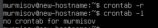

    

    

